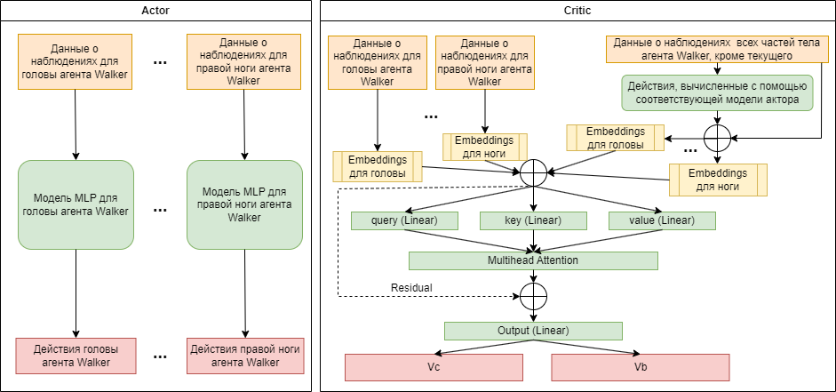
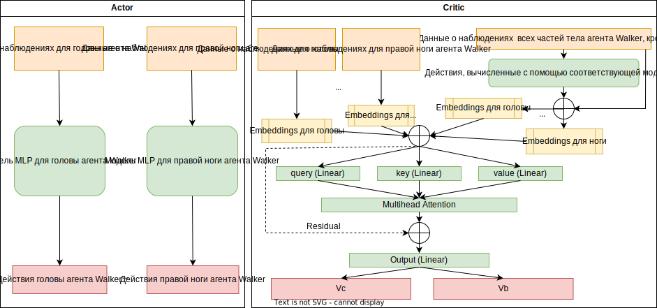

# Применение алгоритма MARL к задаче обучения одного агента, разделяемого на составные части.

В статье [“On the Use and Misuse of Absorbing States in Multi-agent Reinforcement Learning”](https://arxiv.org/abs/2111.05992) команды Unity Technologies от 7 июня 2022 года описан алгоритм обучения MA-POCA.

Для ряда задач обучения группы агентов существует необходимость учитывать возможность добавления или удаления агента в ходе эпизода. Авторы работы предложили новую архитектуру, которая позволяет решать данную задачу. Данный алгоритм не требует фиксированного числа агентов для обучения, таким образом может быть применен в том числе и для задач с добавлением агентов в группу. Основной идеей алгоритма стало применение подхода с использованием механизма внимания [7]. Применение данного подхода позволило изолировать вклад в расчет функции преимущества и функции потерь на основе наблюдений и действий агентов, которые закончили эпизод. В более ранних работах для этих целей применялись менее эффективные подходы, например absorbing states. Которые к тому же не позволяли увеличивать количество агентов в группе.

**Основная идея данного проекта — применить и адаптировать алгоритм MA-POCA к задаче обучения одного агента, которого возможно представить как команду из его составных частей.**

Преимущество и практическая польза такого подхода в том, что это позволит создавать более устойчивых к изменениям агентов. Например, при поломке руки робот может учиться эффективно держать равновесие с одной рукой или даже продолжать решать целевые задачи. В более широком смысле, данный подход позволяет пересмотреть решение ряда практических задач, где возможно представить одного агента в виде команды агентов, решающих единую задачу, и получить пользу от возможностей кооперации составляющих частей агента. Кроме того, в некоторых случаях это может позволить обучать модели с меньшим количеством параметров.

## Среда Walker
Для проведения экспериментов была выбрана среда [Walker](https://github.com/Unity-Technologies/ml-agents/blob/develop/docs/Learning-Environment-Examples.md), разработанная командой Unity. Среда представляет собой модель человекоподобного робота (агента) с 26 степенями свободы. Целью агента является движение в сторону целеуказателя в виде зеленого куба. В случае падения агента эпизод заканчивается.

Агент состоит из 16 составных частей (голова, руки, ноги и т.д.). Каждая составная часть может быть представлена как отдельный агент, а все вместе как одна команда с общим вознаграждением.

Пространство наблюдений, которое предоставляет среда, состоит из 243 вещественных значений и содержит информацию как о среде, так и о всех составных частях агента. Эти данные можно разделить и использовать для обучения каждой части тела агента.

Пространство действий состоит из 39 непрерывных действий, которое так же можно разделить и предоставлять среде отдельно для каждой составной части агента. Действия представляют собой информацию о векторе движения части тела агента и величине прилагаемой силы.

Алгоритм декомпозиции пространств наблюдений: [исходные коды](https://github.com/ntrukhtanov/UnityModels/blob/master/Walker/MAPOCA/body_parts.py).

## Установка зависимостей

Для запуска исходных кодов требуется установка следующих библиотек со всеми зависимостями:

`pip install mlagents==0.30.0`  
`pip install pytorch==1.11.0`  
`pip install tqdm`  

## Установка среды Walker

Для установки среды Walker проследуйте инструкциям по [ссылке](https://github.com/Unity-Technologies/ml-agents/blob/develop/docs/Getting-Started.md).

## Запуск процесса обучения

Для запуска процесса обучения требуется запустить файл [train.py](https://github.com/ntrukhtanov/UnityModels/blob/master/Walker/MAPOCA/train.py) с параметрами, описанными в комментариях к функции train.

## Запуск процесса тестирования с рендерингом в среде Walker

Для запуска процесса обучения требуется запустить файл [run_model.py](https://github.com/ntrukhtanov/UnityModels/blob/master/Walker/MAPOCA/run_model.py) с параметрами, описанными в комментариях к функции run_model.

## Методика проведения экспериментов

### Архитектура модели и принцип работы алгоритма

На рисунке выше отображена схема модели 

## Источники

> juliani2020, Unity: A general platform for intelligent agents, Juliani, Arthur and Berges, Vincent-Pierre and Teng, Ervin and Cohen, Andrew and Harper, Jonathan and Elion, Chris and Goy, Chris and Gao, Yuan and Henry, Hunter and Mattar, Marwan and Lange, Danny, arXiv preprint arXiv:1809.02627, 2020

> cohen2022, On the Use and Misuse of Abosrbing States in Multi-agent Reinforcement Learning, Cohen, Andrew and Teng, Ervin and Berges, Vincent-Pierre and Dong, Ruo-Ping and Henry, Hunter and Mattar, Marwan and Zook, Alexander and Ganguly, Sujoy, RL in Games Workshop AAAI 2022, 2022
