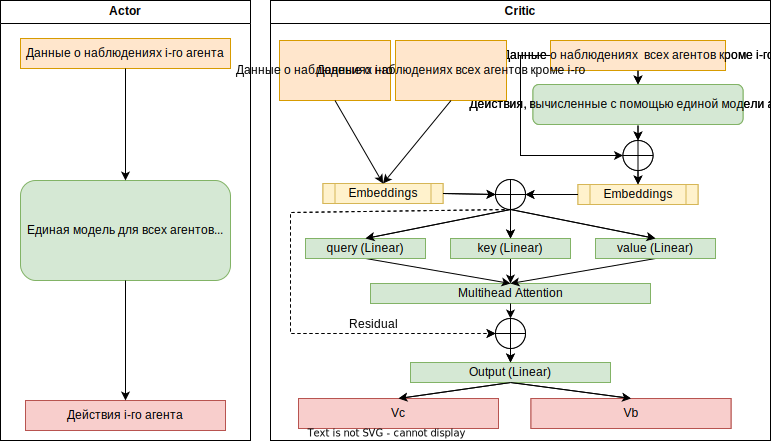
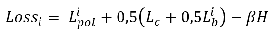
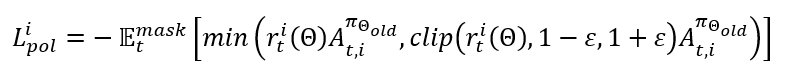
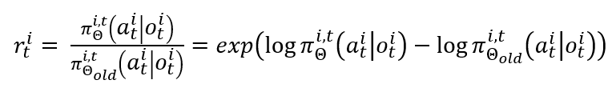
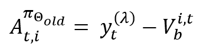
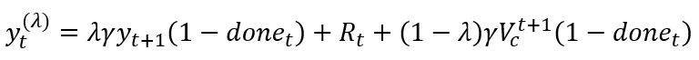
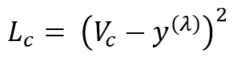
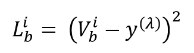
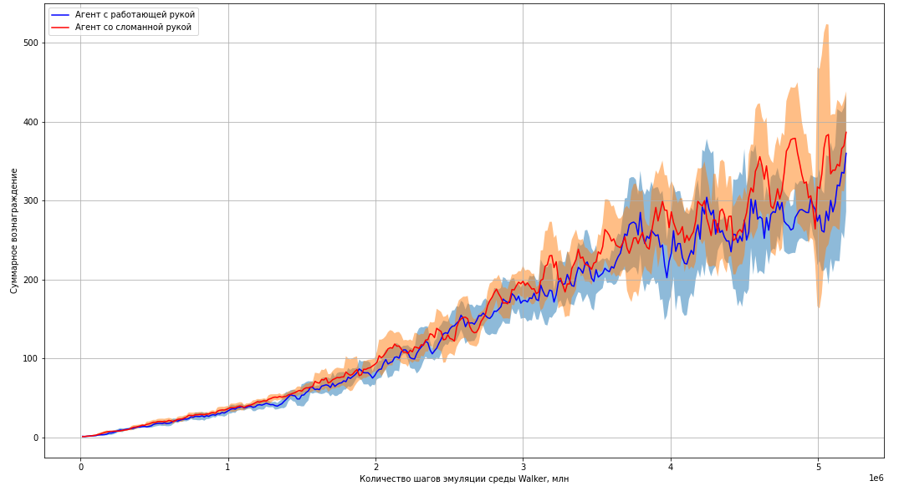

# Применение алгоритма MA-POCA к задаче обучения одного агента, разделяемого на составные части.

В статье [“On the Use and Misuse of Absorbing States in Multi-agent Reinforcement Learning”](https://arxiv.org/abs/2111.05992) команды Unity Technologies от 7 июня 2022 года описан алгоритм обучения MA-POCA.

Для ряда задач обучения группы агентов существует необходимость учитывать возможность добавления или удаления агента в ходе эпизода. Авторы работы предложили новую архитектуру, которая позволяет решать данную задачу. Данный алгоритм не требует фиксированного числа агентов для обучения, таким образом может быть применен в том числе и для задач с добавлением агентов в группу. Основной идеей алгоритма стало применение подхода с использованием механизма внимания [7]. Применение данного подхода позволило изолировать вклад в расчет функции преимущества и функции потерь на основе наблюдений и действий агентов, которые закончили эпизод. В более ранних работах для этих целей применялись менее эффективные подходы, например absorbing states. Которые к тому же не позволяли увеличивать количество агентов в группе.

**Основная идея данного проекта — применить и адаптировать алгоритм MA-POCA к задаче обучения одного агента, которого возможно представить как команду из его составных частей.**

Преимущество и практическая польза такого подхода в том, что это позволит создавать более устойчивых к изменениям агентов. Например, при поломке руки робот может учиться эффективно держать равновесие с одной рукой или даже продолжать решать целевые задачи. В более широком смысле, данный подход позволяет пересмотреть решение ряда практических задач, где возможно представить одного агента в виде команды агентов, решающих единую задачу, и получить пользу от возможностей кооперации составляющих частей агента. Кроме того, в некоторых случаях это может позволить обучать модели с меньшим количеством параметров.

## Среда Walker
Для проведения экспериментов была выбрана среда [Walker](https://github.com/Unity-Technologies/ml-agents/blob/develop/docs/Learning-Environment-Examples.md), разработанная командой Unity. Среда представляет собой модель человекоподобного робота (агента) с 26 степенями свободы. Целью агента является движение в сторону целеуказателя в виде зеленого куба. В случае падения агента эпизод заканчивается.

Агент состоит из 16 составных частей (голова, руки, ноги и т.д.). Каждая составная часть может быть представлена как отдельный агент, а все вместе как одна команда с общим вознаграждением.

Пространство наблюдений, которое предоставляет среда, состоит из 243 вещественных значений и содержит информацию как о среде, так и о всех составных частях агента. Эти данные можно разделить и использовать для обучения каждой части тела агента.

Пространство действий состоит из 39 непрерывных действий, которое так же можно разделить и предоставлять среде отдельно для каждой составной части агента. Действия представляют собой информацию о векторе движения части тела агента и величине прилагаемой силы.

Алгоритм декомпозиции пространств наблюдений: [исходные коды](https://github.com/ntrukhtanov/UnityModels/blob/master/Walker/MAPOCA/body_parts.py).

На каждом шаге агент получает вознаграждение. Чем больше положительное значение вознаграждения, тем выше ценность достигнутого успеха. В случае падения агент получает отрицательное вознаграждение. Для каждой части тела агента цель общая со всем организмом, таким образом для обучения каждой составной части используется общее вознаграждение.

Суммарное накопленное вознаграждение в течение всего эпизода является целевой метрикой.

## Установка зависимостей

Для запуска исходных кодов требуется установка следующих библиотек со всеми зависимостями:

`pip install mlagents==0.30.0`  
`pip install pytorch==1.11.0`  
`pip install tqdm`  

## Установка среды Walker

Для установки среды Walker проследуйте инструкциям по [ссылке](https://github.com/Unity-Technologies/ml-agents/blob/develop/docs/Getting-Started.md).

## Запуск процесса обучения

Для запуска процесса обучения требуется запустить файл [train.py](https://github.com/ntrukhtanov/UnityModels/blob/master/Walker/MAPOCA/train.py) с параметрами, описанными в комментариях к функции train.

## Запуск процесса тестирования с рендерингом в среде Walker

Для запуска процесса обучения требуется запустить файл [run_model.py](https://github.com/ntrukhtanov/UnityModels/blob/master/Walker/MAPOCA/run_model.py) с параметрами, описанными в комментариях к функции run_model.

## Алгоритм MA-POCA
Алгоритм MA-POCA является алгоритмом актора-критика и относится к группе алгоритмов градиента стратегии.  В таких алгоритмах присутствуют два основных компонента. Первая компонента - это актор, который настраивает параметризированные стратегии с помощью градиента стратегии. И вторая компонента — критик, который обучается давать отзывы на стратегию. Актор и критик могут использовать единую модель с разными слоями на выходе, а могут быть полностью двумя разными моделями с различными архитектурами. 
Модель актора используется при работе модели в боевых условиях, модель критика используется только для обучения. 
Глубина сети может быть различной и зависит от решаемой задачи. Это могут быть многослойные полносвязные сети, сверточные, рекуррентные сети. 
Важным элементом алгоритма MA-POCA является наличие блока с механизмом внимания в модели критика, построенного на основе работы [Ashish Vaswani, Noam Shazeer, Niki Parmar, Jakob Uszkoreit, Llion Jones, Aidan N. Gomez, Lukasz Kaiser, Illia Polosukhin, Attention Is All You Need](https://arxiv.org/abs/1706.03762).

<dl>

Схема 1. Архитектура модели MA-POCA.

</dl>

На схеме 1 изображена архитектурная схема модели MA-POCA. В левой части схемы отображена модель актора, справа модель критика. Предположим мы имеем группу агентов, которые должный действовать вместе для достижения общей цели. Пробегаем в цикле по каждому агенту. В модель актора передаем информацию о наблюдениях для i-го агента, на выходе получаем действие, которое выдала текущая стратегия, а так же вероятность выбранного действия и показатель энтропии. А по модели критика пробегаем дважды. В первом проходе в модель критика отправляем информацию о наблюдениях всех агентов. Во втором проходе в модель критика отправляем информацию о наблюдениях i-го агента и информацию о наблюдениях и действиях остальных агентов. Информация поступает в полносвязные слои для расчета эмбедингов. Значения эмбедингов объединяются в тензор в виде последовательности. А затем этот тензор поступает в полносвязные слои query, key, value механизма внимания, затем непосредственно сам слой MultiheadAttention. Выход слоя внимания конкатенируется с входными данными (residual), и поступает в выходные слои модели критика. Агент может в любой момент выйти из игры или вернуться в нее, а значит на входе модели у нас не будет информации о наблюдениях и действиях этого агента. Для этой цели мы используем маску, которая говорит механизму внимания какие элементы последовательности следует исключить из расчета.
В результате для каждого агента мы получим результаты работы модели актора и два массива значений на выходе модели критика. Эти значения используются для расчета функции потерь, минимизируя которую мы обучаем всю модель целиком.

### Формулы для расчета функции потерь
#### 1. Расчет общей функции потерь

Формула 1 описывает общую функцию потерь. По ней оптимизируем всю модель. 
Функция потерь вычисляется отдельно для каждого агента. Первое слагаемое Lpol - это функция потерь для оптимизации 
стратегии или модели актора. Слагаемое Lc - это функция потерь на основе результатов модели критика, рассчитанных 
на основе наблюдений всех агентов. Слагаемое Lb - это функция потерь на основе результатов модели критика, 
рассчитанных на основе наблюдений i-го агента, а так же наблюдений и действий остальных агентов. 
Слагаемые Lc и Lb представляют собой комбинированную функцию полезности модели критика. И последний компонент энтропия. 
Это очень важный компонент, который регулирует выбор модели между исследованием окружающей среды и выбором оптимального 
действия. При высокой энтропии агент выполняет больше случайных действий, тем самым исследуя окружающую среду, 
но получает меньшее вознаграждение из-за ошибок. При низкой энтропии агент получает больше вознаграждений, но меньше 
изучает среду. Коэффициент β помогает поддерживать баланс между исследованием и вознаграждением.

<dl>

Формула 1.

</dl>

#### 2. Расчет функции потерь для стратегии.

Формула 2 описывает расчет функции потерь для стратегии. Знак минус в этой формуле нужен в связи с тем, что нам 
требуется выполнять градиентный подъем для оптимизации стратегии, а оптимизаторы torch выполняют градиентный спуск. 
Далее берем матожидание по всем временным шагам с применением маски, чтобы исключить влияние данных от агентов, 
которые завершили свой эпизод. Далее мы выбираем минимальное из двух произведений. Этот алгоритм аналогичен 
алгоритму PPO и служит для ограничения целевой функции доверительной областью с целью предотвратить 
большие и рискованные изменения стратегии. Алгоритмы расчета множителей r и A показаны в формулах 3 и 4 соответственно.

<dl>

Формула 2.

</dl>

#### 3. Расчет отношения вероятностей действий при данном наблюдении, рассчитанных с помощью обновленной стратегии, к вероятностям действий, рассчитанным с помощью старой стратегии.

Формула 3 описывает отношение вероятностей действий при данном наблюдении, рассчитанных с помощью обновленной 
стратегии, к вероятностям действий, рассчитанным с помощью старой стратегии. Расчет производится для каждого шага 
эмуляции для i-го агента. Вероятности действий для задачи с агентом Walker вычисляются с помощью нормального распределения.

<dl>

Формула 3.

</dl>

#### 4. Расчет функции преимущества.

Формула 4 описывает расчет функции преимущества. Расчет производится для каждого шага эмуляции для i-го агента 
на основе старой стратегии. Здесь первое слагаемое y - целевые значения функции полезности, которые рассчитываются 
по формуле 5. А второе слагаемое V - выходы модели критика на основе наблюдений i–го агента и конкатенации наблюдений 
и действий всех остальных агентов.

<dl>

Формула 4.

</dl>

#### 5. Расчет целевой функции полезности.

Формула 5 описывает расчет целевых значений функции полезности. Значение функции рассчитывается на основе вознаграждений 
и результатов работы модели критика для всех наблюдений агентов. Таким образом оно едино для всех агентов. Расчет 
производится для каждого шага эмуляции. 

В данной формуле:  
λ - весовой коэффициент, который регулирует вклад функции полезности на основе результатов работы критика Vс 
относительно вознаграждения Rt;  
γ - коэффициент дисконтирования вознаграждения;  
done - признак завершения эпизода.

<dl>

Формула 5.

</dl>

#### 6. Расчет функции потерь для оптимизации функции полезности, рассчитанной на основе всех наблюдений агентов.

Формула 6 описывает расчет функции потерь для оптимизации функции полезности, рассчитанной на основе всех наблюдений 
агентов. Ее значение одинаково для всех агентов. Вычисляется как среднеквадратичная ошибка для значений выходов модели 
критика и целевыми значениями функции полезности.

<dl>

Формула 6.

</dl>

#### 7. Расчет функции потерь для оптимизации функции полезности, рассчитанной на основе наблюдений i-го агента и конкатенации наблюдений и действий всех остальных агентов.

Формула 7 описывает расчет функции потерь для оптимизации функции полезности, рассчитанной на основе наблюдений 
i-го агента и конкатенации наблюдений и действий всех остальных агентов. Вычисляется как среднеквадратичная ошибка 
для значений выходов модели критика для i-го агента и целевыми значениями функции полезности.

<dl>

Формула 7.

</dl>

## Адаптация алгоритма MA-POCA

При декомпозиции модели Walker была получена группа из разнородных агентов, т.к. составные части агента имеют разные 
размерности пространства действий. Например, голова агента имеет три значения действий, позвоночник четыре, а предплечье два. 
Кроме того, в данной задаче агенты хотя и имеют общую цель, но выполняют разные задачи. Функционал головы и ног 
различаются, поэтому использовать единую модель для них не целесообразно.

На схеме 2 отображена адаптированная для текущей задачи архитектура модели. Она отличается от исходной тем, что модель 
актора своя для каждого агента из-за разнородности составных частей агента Walker. Таким образом вместо одной модели 
актора мы получили несколько, по одной на каждую часть тела агента. А в модели критика так же потребовалось сделать 
отдельные слои для эмбедингов для каждой части тела агента. Таким образом, была решена проблема разнородности в 
пространствах наблюдений и действий и на вход механизма внимания поступают последовательности одинаковой размерности.

Основные формулы расчета функций потерь не изменились, за исключением того, что теперь для каждой составной части 
агента мы оптимизируем отдельную стратегию.

<dl>

Схема 2. Архитектура адаптированной модели MA-POCA к задаче Walker.

</dl>

## Методика проведения экспериментов

С целью проверки работоспособности адаптированной модели проведем следующий эксперимент. 
Во время обучения для половины экземпляров сред Walker будем отключать левую руку и левое предплечье агента, 
для второй половины оставим агента с рабочей левой рукой.

## Результаты экспериментов

На рисунке 1 отображен график суммарного вознаграждения для агентов.
Ось X 
На графике красные линии обозначают суммарное вознаграждение агента со сломанной рукой,
синие линии обозначают суммарное вознаграждение агента с работающей рукой.

<dl>

Рисунок 1. График суммарного вознаграждения.

</dl>

По ссылке доступно видео движения агента, на котором первые 20 секунд агент движется с работающей левой рукой, 
а затем рука обездвиживается.

Таким образом можно сделать вывод, что предложенный подход позволяет решать задачу обучения декомпозированного агента 
как группу агентов. Тем самым открывая возможность обучать более устойчивых к изменениям агентов, а так же потенциально 
извлекать пользу от кооперации составных частей агента.

## Источники

> juliani2020, Unity: A general platform for intelligent agents, Juliani, Arthur and Berges, Vincent-Pierre and Teng, Ervin and Cohen, Andrew and Harper, Jonathan and Elion, Chris and Goy, Chris and Gao, Yuan and Henry, Hunter and Mattar, Marwan and Lange, Danny, arXiv preprint arXiv:1809.02627, 2020

> cohen2022, On the Use and Misuse of Abosrbing States in Multi-agent Reinforcement Learning, Cohen, Andrew and Teng, Ervin and Berges, Vincent-Pierre and Dong, Ruo-Ping and Henry, Hunter and Mattar, Marwan and Zook, Alexander and Ganguly, Sujoy, RL in Games Workshop AAAI 2022, 2022
